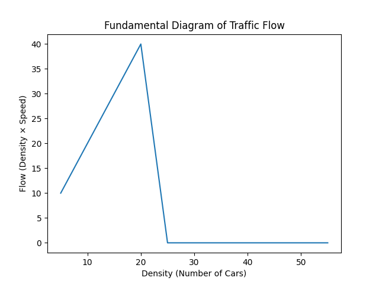

# Emergent Traffic Dynamics: A Physics-Based Simulation of Congestion and Flow

## Overview
This project models traffic flow using a particle-based simulation inspired by principles from physics and applied mathematics. Vehicles are represented as interacting agents on a one-dimensional circular road, where simple local rules give rise to complex global behavior such as congestion and shockwave formation.

The project combines visual simulation with quantitative analysis to study how traffic flow evolves as vehicle density increases.

---

## Motivation
Traffic congestion is a real-world problem with significant economic and environmental impact. Understanding how congestion emerges from individual driver behavior is an important problem in transportation engineering and physics.

This project explores how macroscopic traffic patterns arise from microscopic rules, drawing connections to concepts in statistical mechanics and nonlinear systems.

---

## Key Features
- Simulation of traffic flow using a discrete particle-based model  
- Emergence of congestion without external bottlenecks  
- Observation of backward-propagating shockwaves  
- Quantitative analysis of flow-density relationships  
- Generation of the fundamental diagram of traffic flow  

---

## Methodology

### Simulation Model
- Vehicles are modeled as particles on a circular road
- Each vehicle follows simple rules:
  - Accelerate when sufficient space is available
  - Decelerate when approaching another vehicle
  - Occasional random braking to simulate human behavior

### Analysis
- Simulations are run across varying vehicle densities
- Average velocity is measured over time
- Traffic flow is computed as:
  
  Flow = Density × Average Velocity

---

## Results

The analysis produces the fundamental diagram of traffic flow:

### Key Observations
- At low densities, vehicles move freely and flow increases with density
- At intermediate densities, flow reaches a maximum
- At high densities, congestion dominates and flow decreases sharply
- Small perturbations can generate shockwaves that propagate backward through the system

These results demonstrate the nonlinear nature of traffic systems and the existence of a critical density beyond which traffic collapses.

---

## Technical Stack
- Python
- NumPy
- Matplotlib

---

## Project Structure
